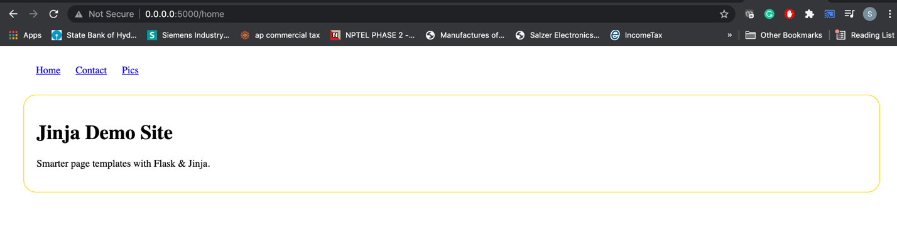
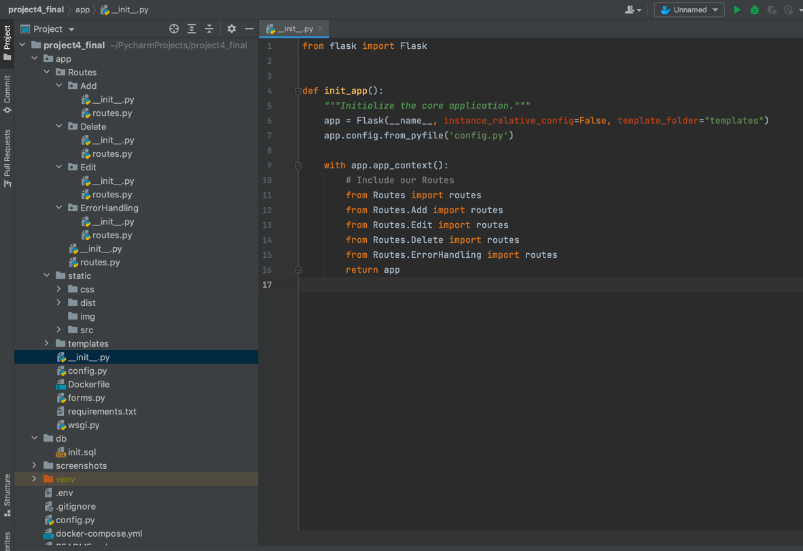
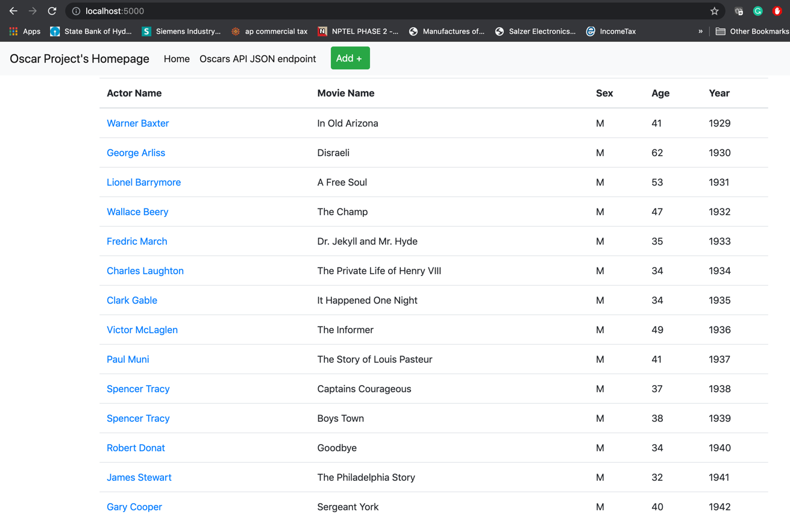

# Project4 - Final - Oscar Awards Project
### - Avinash Sriram Chamarthy

## Technologies Used: HTML, CSS, Python, Docker, MySQL, Flask, GIT

## Changes Made:
### 1.Used Flask Framework
### 2.Rendered pages using Jinja
### 3.Moved all the configuration data into config file.
### 4.Separated the routes accordingly into separate categories(Ex: add,edit,delete)
### 5.Used to concept of Demystifying Flask’s Application Factory and started the app using wsgi.py

## Flask and Jinja2 Example:

## Separation of Concerns

## Home Page:

