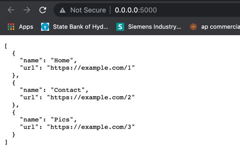
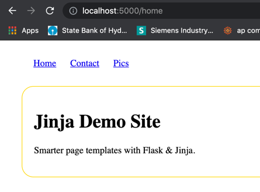
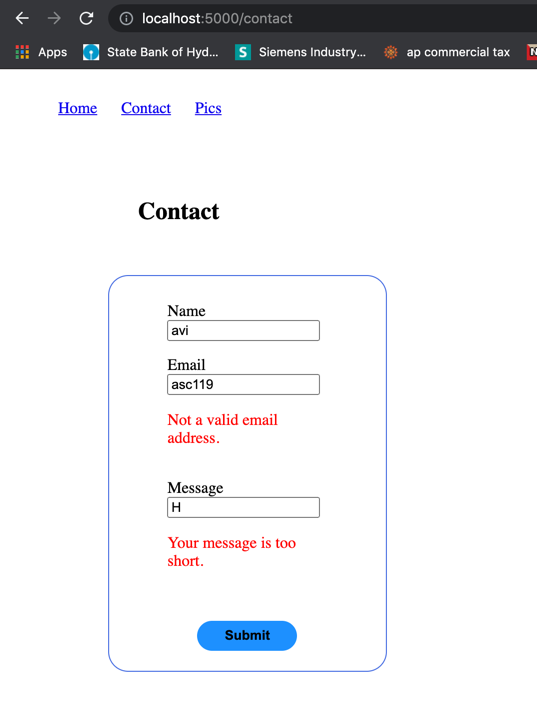
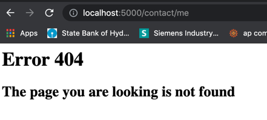
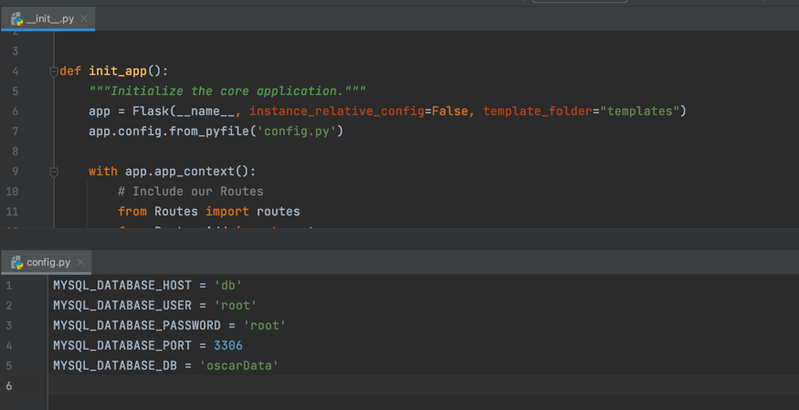
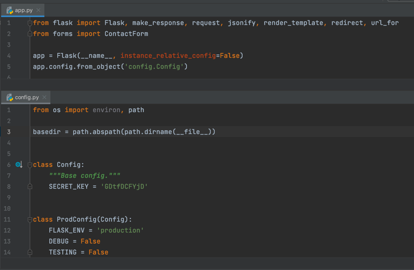
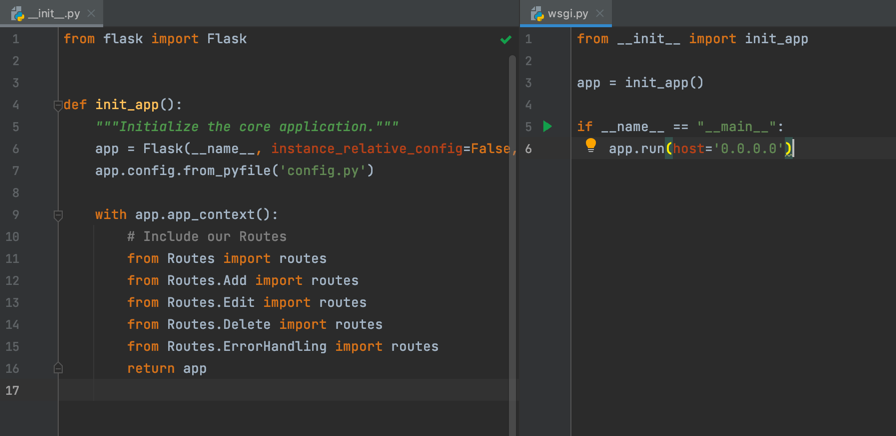
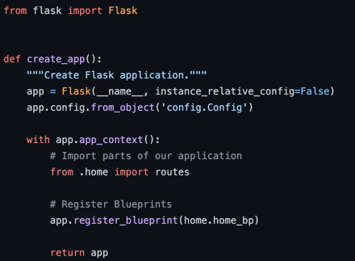

# Project4 - Final - Oscar Awards Project
### - Avinash Sriram Chamarthy

## Technologies Used: HTML, CSS, Jinja2, Python, Docker, MySQL, Flask, GIT

## In this project, the below tasks were done
### 1. Created an example project as per the article and implemented the steps given
### 2.Based on those steps provide in the article,The Oscar website is completely modified accordingly.

## Modified the Oscar Website completely as per the Article:
### 1.Used Flask Framework
### 2.Rendered pages using Jinja
### 3.Moved all the configuration data into config file.
### 4.Separated the routes accordingly into separate categories(Ex: add,edit,delete)
### 5.Used to concept of Demystifying Flask’s Application Factory and started the app using wsgi.py

## Screenshots of the project
* [Click here](https://github.com/avinash2459/project4_final/blob/master/Project4%20_Final.pdf) for the PDF.

## Steps followed from tutorial
### Step 1 - Creating Your First Flask Application

### Step 2 - Rendered Pages in Flask Using Jinj

### Step 3 - Handling Forms in Flask with Flask-WTF

### Step 4 - The Art of Routing in Flask

### Step 5 - Configured Flask App using config and .env files

### Step 6 - Demystifying Flask’s Application Factory

### Step 7 - Organizing Flask Apps with Blueprints

## Flask and Jinja2 Example:

## Separation of Concerns

## Home Page:

